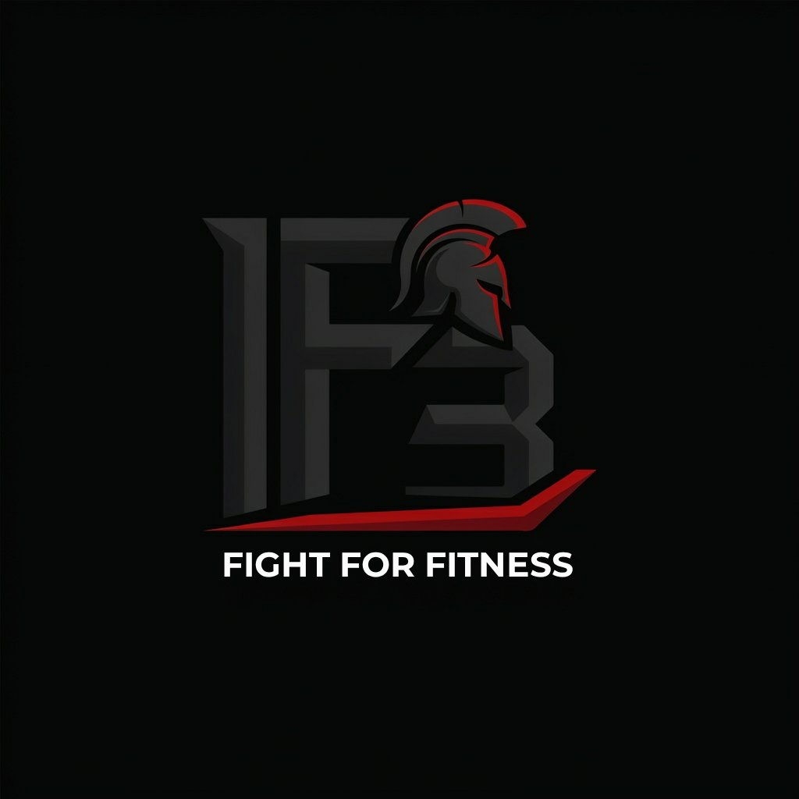

# F3 — Fight For Fitness 🥊

> Where Warriors Are Forged — Premium fitness brand website built with React, Vite, GSAP, Framer Motion and TailwindCSS.



---

## 🚀 Quick Start

```bash
# 1. Install dependencies
npm install

# 2. Start development server
npm run dev

# 3. Open in browser
# http://localhost:5173
```

---

## 📦 Tech Stack

| Category | Technology |
|----------|-----------|
| Framework | React 18 + Vite 5 |
| Routing | React Router DOM v6 |
| Animations | GSAP 3 + ScrollTrigger |
| Page Transitions | Framer Motion 11 |
| Smooth Scroll | Lenis |
| Text Animations | SplitType |
| 3D (optional) | Three.js + @react-three/fiber |
| Styling | TailwindCSS 3 |
| Icons | Lucide React |
| Forms | React Hook Form + Zod |
| SEO | React Helmet Async |
| Unit Tests | Vitest + Testing Library |
| E2E Tests | Playwright |
| Fonts | Bebas Neue, Barlow Condensed, Barlow |

---

## 📁 Project Structure

```
f3-fight-for-fitness/
├── public/
│   └── assets/
│       ├── f3-logo.jpg          # Official brand logo
│       └── f3-intro.mp4         # Intro video (first visit)
├── src/
│   ├── animations/
│   │   └── gsap.js              # GSAP utility functions
│   ├── components/
│   │   ├── common/
│   │   │   ├── Cursor.jsx       # Custom animated cursor
│   │   │   ├── Navbar.jsx       # Sticky navbar + mobile menu
│   │   │   ├── Footer.jsx       # Full footer with CTA
│   │   │   └── PageTransition.jsx
│   │   ├── home/
│   │   │   ├── Hero.jsx         # Fullscreen hero section
│   │   │   ├── WhyChooseF3.jsx  # Features + Philosophy
│   │   │   ├── FeaturedServices.jsx
│   │   │   └── Sections.jsx     # Stats, Testimonials, Gallery Preview, CTA
│   │   └── ui/
│   │       ├── Button.jsx       # ButtonPrimary, ButtonOutline, ButtonGhost, MagneticButton
│   │       └── AnimatedText.jsx # SplitType text animations
│   ├── contexts/
│   │   ├── AppContext.jsx       # Global state (nav, cursor)
│   │   └── LenisContext.jsx     # Smooth scroll provider
│   ├── features/
│   │   ├── intro/
│   │   │   └── IntroVideo.jsx   # First-visit splash video
│   │   └── loader/
│   │       └── Loader.jsx       # Dumbbell loading animation
│   ├── hooks/
│   │   └── index.js             # useGSAP, useMagnetic, useInView, useParallax...
│   ├── pages/
│   │   ├── Home.jsx
│   │   ├── About.jsx
│   │   ├── Services.jsx
│   │   ├── Gallery.jsx          # ⭐ Hero feature — immersive gallery
│   │   └── Contact.jsx
│   ├── routes/
│   │   └── AppRouter.jsx        # Route definitions + lazy loading
│   ├── tests/
│   │   ├── unit/
│   │   │   ├── helpers.test.js
│   │   │   └── Button.test.jsx
│   │   ├── integration/
│   │   │   ├── pages.test.jsx
│   │   │   └── navigation.test.jsx
│   │   ├── e2e/
│   │   │   └── app.spec.js
│   │   └── setup.js
│   ├── utils/
│   │   ├── helpers.js
│   │   └── constants.js
│   ├── App.jsx
│   ├── main.jsx
│   └── index.css
├── package.json
├── vite.config.js
├── tailwind.config.js
├── playwright.config.js
├── netlify.toml
└── vercel.json
```

---

## 🎨 Brand Identity

### Colors
| Name | Hex | Usage |
|------|-----|-------|
| F3 Black | `#000000` | Primary background |
| F3 Dark | `#0a0a0a` | Section backgrounds |
| F3 Red | `#C1121F` | Primary accent |
| F3 Red Accent | `#FF2D2D` | Hover states |
| F3 White | `#FFFFFF` | Text |

### Typography
| Role | Font | Usage |
|------|------|-------|
| Display | Bebas Neue | Hero headlines, numbers |
| Heading | Barlow Condensed | Section headings |
| Body | Barlow | Paragraphs, UI text |

---

## 📄 Pages

### Home (`/`)
- Fullscreen hero with parallax + GSAP split-text
- Why Choose F3 — 6 feature cards
- Training Philosophy — side-by-side layout
- Featured Services — accordion list
- Stats Counter — animated on scroll
- Gallery Preview — linked grid
- Testimonials
- Contact CTA

### About (`/about`)
- Brand story + mission
- Core values grid
- Animated timeline (2018–2024)
- Founder section

### Services (`/services`)
- 6 expandable service cards with Zod-validated details
- Each card: description, features, pricing, duration
- CTA to contact

### Gallery (`/gallery`) ⭐
**The hero feature — Awwwards-level experience:**
- Fullscreen hero with parallax
- 3 × fullscreen clip-path reveal sections
- GSAP-pinned horizontal scroll strip
- Animated marquee strip
- Filtered masonry grid (6 categories)
- Framer Motion lightbox with keyboard navigation + thumbnail strip
- Full-bleed community highlight

### Contact (`/contact`)
- React Hook Form + Zod validation
- Success/error states
- Phone, Email, WhatsApp CTAs
- Business hours
- Map placeholder
- Social links

---

## 🧪 Testing

```bash
# Unit + integration tests
npm test

# Watch mode
npm run test:watch

# Coverage report
npm run test:coverage

# Playwright E2E (requires running dev server)
npm run test:e2e
```

### Test Coverage
| Category | Files |
|----------|-------|
| Unit | `helpers.test.js`, `Button.test.jsx` |
| Integration | `pages.test.jsx`, `navigation.test.jsx` |
| E2E | `app.spec.js` — 30+ scenarios |

---

## 🏗️ Build

```bash
# Production build
npm run build

# Preview production build locally
npm run preview
```

---

## 🌐 Deployment

### Netlify
```bash
# Manual deploy
netlify deploy --prod --dir=dist

# Or connect GitHub repo — netlify.toml handles the rest
```

### Vercel
```bash
# Manual deploy
vercel --prod

# Or connect GitHub repo — vercel.json handles the rest
```

---

## ✨ Key Features

### Intro Video (First Visit Only)
```
if (!localStorage.f3_hasSeenIntro) {
  → Play /assets/f3-intro.mp4 fullscreen
  → Show skip button after 2s
  → Auto-continue when video ends
  → Set localStorage.f3_hasSeenIntro = 'true'
}
```

### Custom Cursor
- Red dot tracks mouse precisely with GSAP
- Lagging ring creates depth
- Expands on hover over interactive elements
- Auto-hides on touch devices

### Smooth Scroll
- Lenis instance synced with GSAP ticker
- ScrollTrigger uses Lenis `on('scroll')` for perfect sync
- Configurable duration and easing

### Gallery Horizontal Scroll
- GSAP `pin` + `scrub` on the container
- Track width calculated dynamically
- Refreshes on window resize via `ScrollTrigger.invalidateOnRefresh`

---

## 🔧 Customization

### Add your own images
Replace the gradient placeholders in `GalleryItemVisual` with real `` tags:
```jsx
// In Gallery.jsx - GalleryItemVisual

```

### Add gallery data
Extend `galleryData.items` in `Gallery.jsx`:
```js
{ id: 17, category: 'Strength', title: 'My Title', src: '/gallery/img17.jpg', ... }
```

### Update contact info
Edit `src/utils/constants.js` → `BRAND` object.

### Change brand colors
Edit `tailwind.config.js` → `theme.extend.colors`.

---

## ⚡ Performance Notes

- **Code splitting**: All pages are lazy-loaded with `React.lazy`
- **GSAP contexts**: All GSAP animations are wrapped in `ctx.revert()` cleanup
- **ScrollTrigger**: All triggers are killed on component unmount
- **Lenis + GSAP**: Synced via `gsap.ticker` — zero double-RAF
- **Images**: Recommend WebP format, `loading="lazy"` on below-fold images
- **Fonts**: Loaded via `@fontsource` (self-hosted, no Google Fonts network call)

---

## 📱 Responsive Breakpoints

| Size | Width |
|------|-------|
| Mobile S | 375px |
| Mobile M | 390px |
| Mobile L | 430px |
| Tablet | 768px |
| Tablet L | 1024px |
| Desktop | 1280px |
| Desktop L | 1440px |
| Desktop XL | 1920px |

---

## 🪪 License

© 2024 Fight For Fitness (F3). All rights reserved.

Built with 🥊 by the F3 development team.
